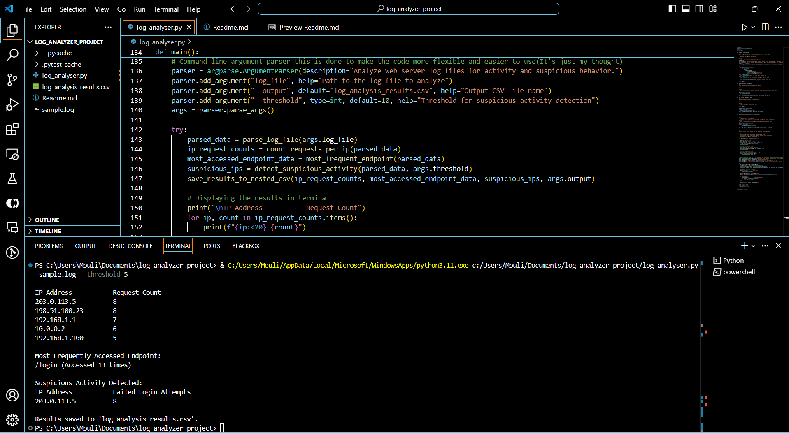

# Log Analysis Script

## Overview
This script processes a web server log file to analyze activity, detect suspicious behavior, and generate a report. It extracts key metrics such as:
1. Requests per IP address.
2. The most frequently accessed endpoint.
3. Suspicious activity based on failed login attempts.
4. Display results clearly & structured on terminal as well as in a csv.




## Features
- Parses log files efficiently.
- Counts and ranks requests by IP address.
- Detects brute-force attempts (configurable threshold).
- Outputs results in a terminal-friendly format and saves them to a CSV file.


## Prerequisites
- Python 3.x
- A valid web server log file.

## Usage
1. Place the log file in the same directory as the script.
2. Run the script:
   ```bash
   python log_analyser.py sample.log --threshold 10 --output results.csv

 -> You can change the threshold value to adjust the sensitivity of brute-force detection. The default of it will be 10 as per the problem      statement.

 -> You can also change the output file name as per your requirement. But if you don't provide the output file name, it will be saved as log_analysis_results.csv by default.

## Reference and Credits
- This script is based on the problem statement provided.I have used some documents and youtube tutorials to understand the problem and implement the solution. Links to that are provided below :

    [Regular Experience](https://docs.python.org/3/howto/regex.html)

    [Csv Writing](https://docs.python.org/3/library/csv.html)

    [About Documentation (Docstrings)](https://medium.com/geekculture/the-importance-of-writing-clear-docstrings-in-programming-62bffffa3881#:~:text=Best%20practices%20%26%20benefits,of%20the%20return%2C%20if%20any.)


